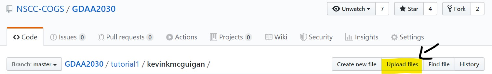
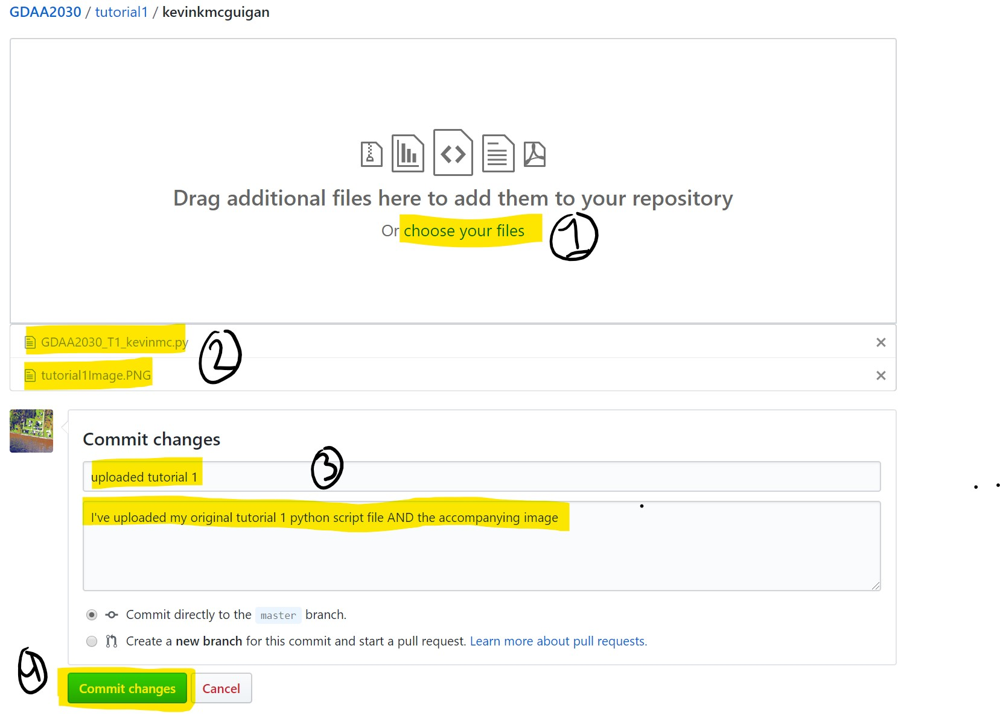
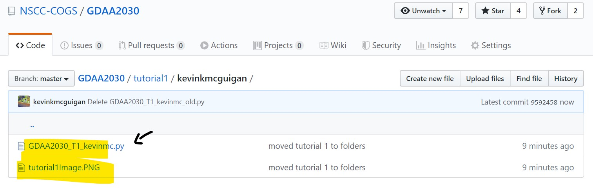

# Tutorial 1 (the github expansion pack!)

Lets do our first thing together on github! 

>In order to make sure this works, lets keep this simple!

Previously we had completed Tutorial 1 in class. Good work! Now we are all going to move that code to github so it is <i>officially</i> recorded for the world to see in glorious OpenSource! 

Above this readme you should find a folder with your super special gitHub login name. 
for example: https://github.com/NSCC-COGS/GDAA2030/tree/master/tutorial1/kevinkmcguigan

***

Navigate to the folder with <b>your git name</b> - and locate the upload button.

***

***

then.. locate your python script file from Tutorial 1 <b>AND</b> the accompanying image you chose for tutorial one. (We will be using this image later)

***

***

> Note: every time you upload something to a git you have to 'commit changes'. As a part of this process you describe the changes you are making (brifly and again optionally in more detail). These little messages becomes a godsend for tracking though the many changes you may have made to a git reposititory so (in general) try your best to keep then sussinct and descriptive. 

Once your files are commited and uploaded you should see them appear in approprate location on the git repo page! Hurrah!

***

***

Well done! You've gone open source!

Le me know if you have any issues with this - if we get past this step there will be more instructions coming soon!

> You all previously didn hand in Tutorial 1 and the accompanying image on brightspace. If you are having trouble tracking down these files let me know. 

Cheers all!