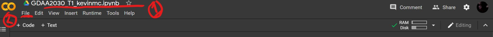

# Tutorial 1 (the github expansion pack!)

## Part 1 - Uploading our .py script file
Lets do our first thing together on github! 

>In order to make sure this works, lets keep this simple!

Previously we had completed Tutorial 1 in class. Good work! Now we are all going to move that code to github so it is <i>officially</i> recorded for the world to see in glorious OpenSource! 

Above this readme you should find a folder with your super special gitHub login name. 
for example: https://github.com/NSCC-COGS/GDAA2030/tree/master/tutorial1/kevinkmcguigan

***

Navigate to the folder with <b>your git name</b> - and locate the upload button.

<!------>
<kbd></kbd>

then.. locate your python script file from Tutorial 1 <b>AND</b> the accompanying image you chose for tutorial one. (We will be using this image later)

<!---[uploaded](2_uploading.jpg)--->
<kbd></kbd>

> Note: every time you upload something to a git you have to 'commit changes'. As a part of this process you describe the changes you are making (brifly and again optionally in more detail). These little messages becomes a godsend for tracking though the many changes you may have made to a git reposititory so (in general) try your best to keep then sussinct and descriptive. 

<!------>
<kbd></kbd>

Once your files are commited and uploaded you should see them appear in approprate location on the git repo page! Hurrah!
***

Well done! You've gone open source!

Le me know if you have any issues with this - if we get past this step there will be more instructions coming soon!

> You all previously didn hand in Tutorial 1 and the accompanying image on brightspace. If you are having trouble tracking down these files let me know. 

Cheers all!

## Part 2 converting to a .ipynb file

### Moving to Google Colab

In the browser (such as say chrome, firefox, or microsoft edge) navigate to https://colab.research.google.com/

You should see some nice welcoming page such as this (you maybe prompted to login)

<kbd></kbd>

Once there..
1. login to your google account (if you havent already)
2. make a new 'Notebook by' selecting  <i>file>new notebook</i>

You should be greeted with a fancy new empty notebook like below. Oh the posibilities! 

<kbd></kbd>

This is notebook gives us access to a server hosted by google where we can perform python commands! Cloud computing! 

Now the first thing we are going to do is get access here to our git files with the following command. 

><code>!git clone https://github.com/NSCC-COGS/GDAA2030.git</code>

copy or tyepe this into into your notebook and run the command as below...

<kbd></kbd>

1. enter the command to pull our git to this cloud server
2. hit the big white button to run the command 
- note you can also generally hit CRTL+ENTER to run the code block you have selected
3. after the code is run, notice the RAM and CPU were using - the machine has spun up! (remember, the google omputer were burrowing, not yours.)
4. We can also see the console output from the command below

ok..
    
>BIG note once this step is complete, comment it out! (CTRL+/)

Now, were going to find our tutorial1.py files and load them into the google colab notebook... Excuse me this ones a little dense.. 

<kbd></kbd>

with the above code run and your virtual instance active...

1. find and click the little <b>folder</b> icon to the far left
2. Navigate though the file system of the machine to find YOUR tutorial1.py file (neat!) and DOUBLE click on th file...
3. This should open the python file to be viewed on the right hand side...
4. Create an NEW code block in the python notebook (the thing in the center of the screen) by selecting <i> Insert > Code Cell </i> from the taskbar at the top...
5. Now simply SELECT all the text in tutorial.py and COPY it into the new empty code cell! Hurrah! 

> note there are slicker more complicated ways of going about doing importing .py files but this works for us!

Now! Our python codes were all built to run on our local machines 
wont work here just yet. (If you run it now you'll get an error). We need to set the new path to the image we used on this cloud machine.. 

<kbd></kbd>

simply...
1. find and RIGHT click on the approprate image in the virtual machine's file system (ie, tutorial1Image.PNG) and select <i>copy path</i>
2. comment out the line in the code where we originally set the location of the image file and inset the new line:

<code>image = plt.imread('^^PASTE YOUR HERE^^')</code>

> Big Note! and do paste the copied location between the quotes above!

3. Hit the little white 'run' button on the new code block
4. If everything went according to plan.. check out the results of Tutorial 1 below! 

### Saving it back to Github

Awesome! Now... this wont generally work outside of this environment as once again the path we set to the tutorials image is essentially local to <i>this</i> cloud machine 

But! We can instead point directly to our image on the git website - this will work more generally:

<kbd></kbd>

1. comment out the previous method for loading the image (CRTL+/) and enter the following:

<code>
import requests

import matplotlib.image as mpimg

url = 'https://github.com/NSCC-COGS/GDAA2030/blob/master/tutorial1/kevinkmcguigan/tutorial1Image.PNG?raw=true'

img_raw = requests.get(url, stream=True).raw

image = mpimg.imread(img_raw)
</code>

>BIG NOTE: the above url will be different for each of your images on the git. You must simply navigate on the github website to the location of the image and copy that url and add '?raw=true' onto the end. As a matter of fact - using this method you can point to any image link openly avilable on the internet - you will only specificalyl need the '?raw=true' for images hosted on hithub repos. 

2. note that in this insance we no longer need to set the image to an a numpy array as it will already be one -  but setting and array to an arry is not the end of the world (it wonr break anything) and your specific code may vary 

3. then test the new code by once again running 

Once everything is up and running we can save this back to our github repo! In coloab simply

<kbd></kbd>

1. Rename the file at the top, similarly to your .py file BUT with a .ipynb extension!
> for example: <code>GDAA2030_T1_kevinmc.ipynb</code>
2. in the colab task bar at the top select <i>File > Download .ipynb</i>

FINALLY! Upload your new .ipynb to the same location on the GDAA2030 git as your origional tutorial 1 .py file! Once its uploaded, check it out on github in all its python notebook glory! 
(for example: https://github.com/NSCC-COGS/GDAA2030/blob/master/tutorial1/kevinkmcguigan/GDAA2030_T1_kevinmc.ipynb)

## Part 3 Modifying your README.md file

<i>stay tuned... </i>