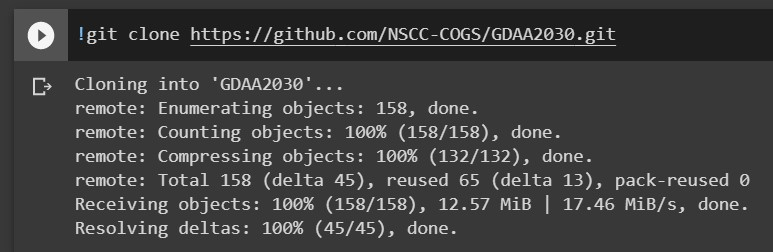
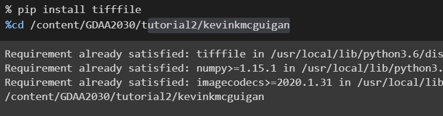
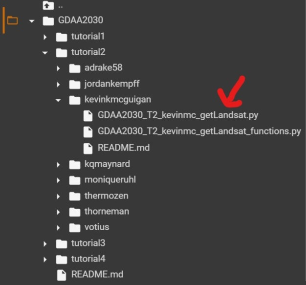
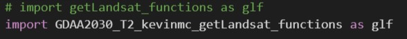
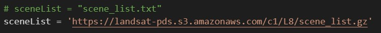
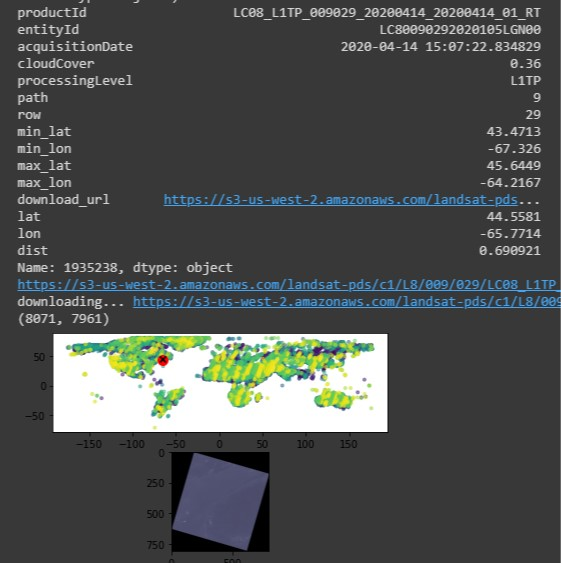

# Tutorial 2 (more git and colab!)

<b>Assignment: find and upload the two .py scripts associated with tutorial 2. Modify and upload the controlling script into functioning .ipynb file using google colab.</b>

***

## A little Background

Hey if you're here I hope you've completed the materials in [Tutorial 1](https://github.com/NSCC-COGS/GDAA2030/tree/master/tutorial1). By now we should be relatively comfortable with the GihHub website and [Google Colab](https://colab.research.google.com/). 

The plan for Tutorial 2 is to, <i>once again</i>, load the python script materials we did together in class for tutorial 2 onto this gitHub repo - and then create a new python notebook (.ipynb) file using Google Colab. 

So! As it turns out this time around - tutorial 2 actually works better and more simply on Google Colab than it idi in class! (I mean, I suppose Google does propbably have a better internet connection... ) Remember in this tutorial we use a the python library [Pandas](https://pandas.pydata.org/) to index and query a relatively large text file containing metadata and links to access Landsat 8 data from Amazon Web Services (AWS, [heres some more info](https://docs.opendata.aws/landsat-pds/readme.html)). We then used [matplotlib](https://matplotlib.org/) to display an overview plot of the avilable landsat scenes as well as a display a selected scene (which the script also downloaded..)

Remember - we accomplised this with a total of two python scripts, for example: 
* [GDAA2030_T2_kevinmc_getLandsat.py](https://github.com/NSCC-COGS/GDAA2030/blob/master/tutorial2/kevinkmcguigan/GDAA2030_T2_kevinmc_getLandsat.py) - which served as a 'controlling' script to call functions from the other
* [GDAA2030_T2_kevinmc_getLandsat_functions.py](https://github.com/NSCC-COGS/GDAA2030/blob/master/tutorial2/kevinkmcguigan/GDAA2030_T2_kevinmc_getLandsat_functions.py) - which contained functions 

Now - once the <b>3 script files</b> above are uploaded into YOUR tutorial 2 folder ... 

    ie: https://github.com/NSCC-COGS/GDAA2030/blob/master/tutorial2/[YOUR NAME]
we can actually get the same functionality by converting  the controlling script (ie <code>GDAA2030_T2_[YOUR NAME]_getLandsat.py</code>) into a python notebook and changing a few lines. 

## Instructions:
For assistance - see [Tutorial 1](https://github.com/NSCC-COGS/GDAA2030/tree/master/tutorial1).
1. Open a NEW NOTEBOOK on [Google Colab](colab.research.google.com)
2. In the first empty code block, insert the following command yo pull our git to the Google Colab instance's local drive and hit the white run button (or CRTL-ENTER)
    
        !git clone https://github.com/NSCC-COGS/GDAA2030.git

    you should see the git repo being pulled. Remember you can hit the little folder icon on the left of your screen in google colab to navigate the local file system once this is done. 

    <kbd></kbd>

    Its best to 'comment' this line out once its complete to avoid pulling the git repo again by accident

3. Next were going to need to install the library tifffile and change our working directorty to access your uploaded python code. This is done with the following  commands in a new code cell (select Insert>New Code Cell..). 

        % pip install tifffile
        %cd /content/GDAA2030/tutorial2/kevinkmcguigan

    run it and see pip instal a new library to the Google Colab machine! The power! 

    <kbd></kbd>

4. Now, like in tutial 1. Were going to find and open the .py file we'd like to convert to a .ipynb file in the file system of Google Colab, double click, and copy the contents of the .py file into a New Code Cell.. So find the file (ie <code>GDAA2030_T2_[YOUR NAME]_getLandsat.py</code>) For example...

    <kbd></kbd>
    
5.  In the copied .py file contents, ensure that the imported .py file match the name of the file you uploaded to gitHub (<i>without</i> a .py on the end)

    for example:

    <kbd></kbd>

6. Now the nifty part.. When we feed the text file to the function 

    <code>sceneDf = glf.loadSceneList(sceneList, sceneTest, cloudCoverMax)</code> 

    we <i>can</i> send the zipped url of the location of the file <i>DIRECTLY</i>. Neat! 

    So, ensure that the variable sceneList equals the following link:

        https://landsat-pds.s3.amazonaws.com/c1/L8/scene_list.gz

    for example: 

    <kbd></kbd>

7. <b>Run the code!</b>

    If everything goes according to plan you should see the same graphical results as we had in classs! If you're hacing issues getting this to run correctly - take a look at my [example code](https://github.com/NSCC-COGS/GDAA2030/tree/master/tutorial2/kevinkmcguigan).  

8. Once again, save the .ipyb file renaming the file (ie, <code>GDAA2030_T2_[YOUR NAME]_getLandsat.ipynb</code>) and upload the results to the gitHub.  

Check it out! 

<kbd></kbd>

Very Cool!

## Did it work?
Once youre done here, your folder for Tutorial 2 should like similar to [mine](https://github.com/NSCC-COGS/GDAA2030/tree/master/tutorial2/kevinkmcguigan).
If you're stuck, check out my .ipynb [here](https://github.com/NSCC-COGS/GDAA2030/blob/master/tutorial2/kevinkmcguigan/GDAA2030_T2_kevinmc_getLandsat.ipynb)
If you have any questions don't hesitate to ask!

